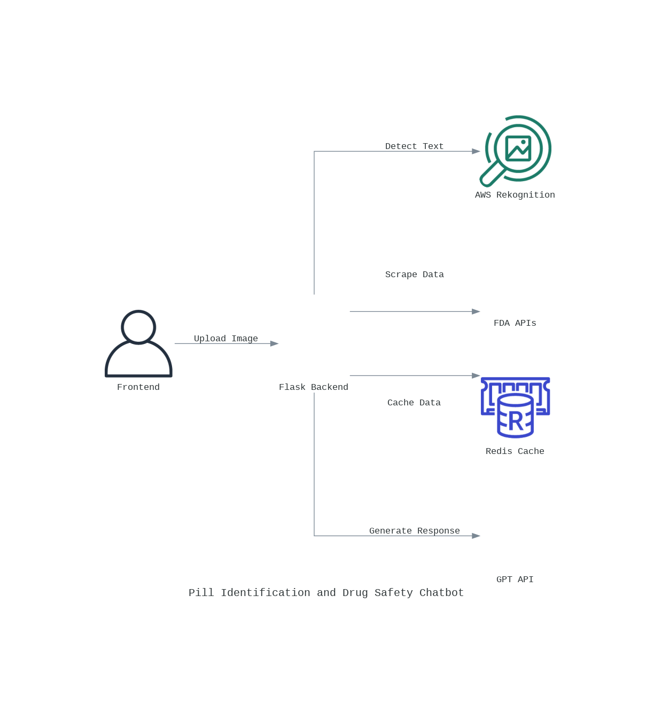

# Pill Identification and Drug Safety Chatbot 💊

**AI-powered medication analysis system using AWS Rekognition and FDA data**



## 🚀 Key Features

- **Pill Imprint Extraction** - AWS Rekognition-based text detection from pill images
- **FDA Data Integration** - Real-time drug information lookup from government APIs
- **Medication Safety Chat** - OpenAI-powered conversations about drug interactions/usage
- **Error Detection** - Flag potential incorrect pill identification (LASA risks)

## ⚙️ Core Components

### Backend Services

| Endpoint           | Method | Description                          |
| ------------------ | ------ | ------------------------------------ |
| `/health`          | GET    | Service health check                 |
| `/extract_imprint` | POST   | Process pill images (JPEG/PNG)       |
| `/get_pill_info`   | POST   | Fetch drug details from imprint code |
| `/conversation`    | POST   | AI-powered drug safety Q&A           |

## 🛠️ Installation

```bash
# Clone repository
git clone https://github.com/yourusername/pill-identification-system.git
cd pill-identification-system

# Install dependencies
python -m venv venv
source venv/bin/activate
pip install -r requirements.txt

# Start Redis
docker run -p 6379:6379 -d redis:alpine

# Run application
python server.py
```

## 🔧 Configuration

Create `.env` file:

```ini
AWS_ACCESS_KEY_ID=your_aws_key
AWS_SECRET_ACCESS_KEY=your_aws_secret
REDIS_HOST=localhost
REDIS_PORT=6379
OPENAI_API_KEY=your_openai_key
FDA_BASE_URL=https://api.fda.gov/drug
```

## 📚 API Documentation

### POST `/extract_imprint`

**Request:**

```bash
curl -X POST -F "image=@pill.jpg" http://localhost:6969/extract_imprint
```

**Response:**

```json
{
  "imprint_number": "AN 715",
  "generic_name": "Lisinopril",
  "summary": "Used for high blood pressure treatment..."
}
```

### POST `/conversation`

**Request:**

```json
{
  "imprint_number": "AN 715",
  "generic_name": "Lisinopril",
  "user_query": "What are the side effects?",
  "not_this_pill": false
}
```

**Response:**

```json
{
  "explanation": "Common side effects include dizziness...",
  "lasa_warning": ["Hydroxyzine"]
}
```

## 🧠 Key Implementation Details

### AWS Rekognition Integration

```python
class RekognitionTextExtractor:
    def extract_text(self):
        client = boto3.client('rekognition')
        response = client.detect_text(Image={'Bytes': self.image_bytes})
        return self._process_response(response)
```

### Redis Caching Strategy

```python
# Cache key format: <imprint_number>:<generic_name>
cache_key = f"{imprint_number}:{generic_name}"
redis_client.setex(cache_key, 3600, json.dumps(pill_data))  # 1-hour expiry
```

### FDA Data Processing

```python
class HtmlParser:
    def parse_content(self):
        # Web scraping logic for FDA data
        self.output_name = self.soup.find('span', class_='drug-name').text
        self.output_summary = self.soup.find('div', class_='drug-summary').text
```

## 🚨 Error Handling

| Error Code | Description           | Resolution           |
| ---------- | --------------------- | -------------------- |
| 400        | Missing/invalid file  | Check request format |
| 404        | No pill data found    | Verify imprint code  |
| 500        | Internal server error | Check server logs    |

## 🌐 Deployment

```yaml
# docker-compose.yml
version: "3.8"
services:
  app:
    build: .
    ports:
      - "6969:6969"
    environment:
      - AWS_ACCESS_KEY_ID
      - AWS_SECRET_ACCESS_KEY
      - OPENAI_API_KEY
    depends_on:
      - redis

  redis:
    image: redis:alpine
    ports:
      - "6379:6379"
```

## 📝 License

MIT License - See [LICENSE](LICENSE)

**Note:** Requires React frontend implementation for full functionality. Replace placeholder FDA scraping logic with actual API integration.
